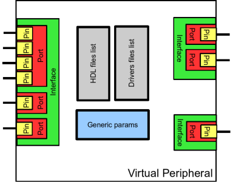

Introduction
++++++++++++

What is PeriphOnDemand (POD) ?
------------------------------

POD is a toolbox of Open Source programs simplifying the integration of Virtual
Peripherals (also called virtual components in this document) in FPGAs. A Virtual
Peripheral is defined as an  `FPGA IP <http://en.wikipedia.org/wiki/IP_core>`_
providing a bus interface.

POD is designed to be use by embedded system developers. Beginners with a small
knowledge in digital design (FPGA design) will be able to easily integrate and
configure virtual peripherals on their platform (an electronic board equiped
with a FPGA).

POD was initially designed for platforms with one main processor connected to
one FPGA, other architectures can be although supported. 

**Capabilities:**

* POD uses external proprietary software (Xilinx ISE, Altera Quartus,...) to 
  synthetize and configure the FPGA.
* POD is designed to generate code in several digital programming langage (VHDL,
  Verilog, ...)
* It is able to generate drivers for targeted operating system
* POD comes with a library of severals components that can be directly
  integrated in user project.

Project architecture
--------------------

**Platform**

**Component instance**

